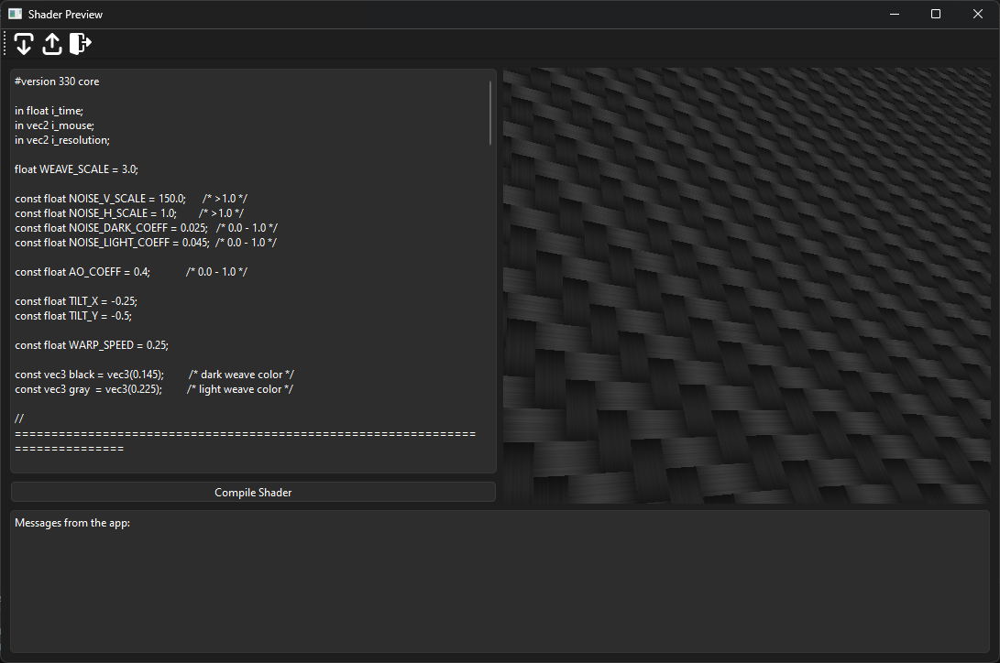

# PyShader
This app allows for previewing fragment shaders in real time. The user can edit and recompile the 
shader source code during runtime.



## Cloning
To clone and run this app use:
```
git clone https://github.com/JulianKonowalski/PyShader.git
cd PyShader
pip install -r requirements.txt
python src/main.py
```

## Usage
The app allows you to:
* Load shaders
* Save shaders

You can use any of these actions by clicking the corresponding icon on the main task bar.